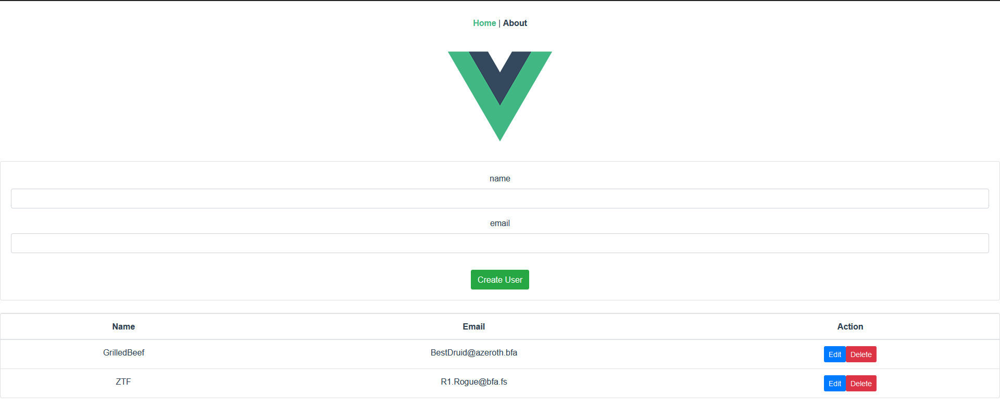

# v3-firelol

<div>
<center><strong>A mini crash course / tutorial i followed along and thought was worth replicating.
made using :

 
 
 
just a change of scenery from my all time favorite  
</strong></center>
</div>
<div align="center">


<small>Credit : https://www.youtube.com/watch?v=Htt8AKeF1Kw</small>

</div>

## Project setup

```
pnpm install
```

### Compiles and hot-reloads for development

```
pnpm run serve
```

### Compiles and minifies for production

```
pnpm run build
```

### Lints and fixes files

```
pnpm run lint
```

### Customize configuration

See [Configuration Reference](https://cli.vuejs.org/config/).
